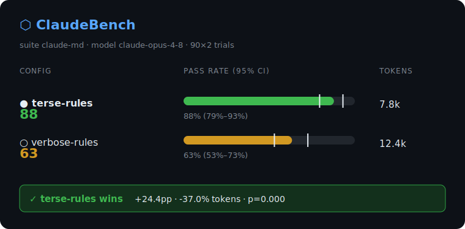

<div align="center">

# ⬡ ClaudeBench

### Stop arguing about prompts. Measure them.

A reproducible benchmark harness for **Claude Code** workflows — prompts, `CLAUDE.md` files,
memory strategies, MCP stacks. Run the same tasks under each setup, get a score with a
**confidence interval**, and find out whether the difference is real or just noise.

[](#)
[](#)
[](#)
[](#)

</div>

---

> *"This CLAUDE.md is better."*
> *"This prompt saves tokens."*
> *"This memory setup works best."*
>
> Cool. **Show the ClaudeBench results.**

The Claude Code ecosystem runs on confident claims and zero evidence. ClaudeBench turns
"I think it's better" into "it's **+24pp** better, **p<0.001**, here's the run you can replay."

---

## 60-second demo — no API key needed

```bash
npx claudebench demo
```

```
⬡ ClaudeBench  ·  suite claude-md  ·  model claude-opus-4-8  ·  trials 90×2

╭─ RESULTS ──────────────────────────────────────────────────────────────────────╮
│     CONFIG         SCORE  PASS RATE  (95% CI)         TOKENS  LATENCY     COST │
│ ●   terse-rules       88  ███████████[░] 88% 79%–93%    7.8k     7.7s  $0.2177 │
│ ○   verbose-rules     63  ███████[█░]░░░ 63% 53%–73%   12.4k     9.0s  $0.3048 │
╰────────────────────────────────────────────────────────────────────────────────╯

  VERDICT  terse-rules wins   SIGNIFICANT   p=0.000
           +24.4pp pass rate   -37.0% tokens   -15.4% latency

  reproduce  npx claudebench replay run-06a65a2f8f36     suite 4fca3b6c8589
```

<div align="center">

</div>

The demo ships with a **recorded fixture**, so it runs instantly, costs nothing, and shows
the same result on every machine. Point it at the real CLI with `--live` when you want fresh numbers.

---

## Why this isn't snake oil

LLM output is **non-deterministic** — temperature, server-side batching, and floating-point
nondeterminism mean the same prompt gives different results run to run. Any "benchmark" that
prints a single exact score is lying to you. ClaudeBench is built around that fact instead of
hiding it:

| Principle | What it means in practice |
|---|---|
| 🎲 **Statistical, not absolute** | Every config runs **N trials**. The score is a pass rate with a **Wilson 95% confidence interval**, not a fake point number. |
| ⚖️ **Winners must be significant** | A two-proportion test decides the verdict. If the intervals overlap, ClaudeBench says **INCONCLUSIVE** instead of crowning noise. |
| 🧪 **Objective grading, no LLM judge** | A task passes iff its **test suite exits 0**. No model grading another model. You can re-run the exact command yourself. |
| 📼 **Record / replay** | Live runs save every transcript + token count to a hashed artifact. `replay` re-scores it **bit-for-bit**, free and offline. |
| 🔓 **Zero black boxes** | Zero runtime dependencies. The scoring math is ~120 lines of commented, unit-tested code in [`src/engine/stats.mjs`](src/engine/stats.mjs). |

> The single most important number on the scorecard isn't the score — it's the **verdict**.
> `INCONCLUSIVE` is a feature. It's the word that ends most of these arguments honestly.

---

## How it works

```
   suite.json                run                 grade                score
  ┌──────────┐   for each   ┌──────────┐  test  ┌─────────┐  N×    ┌──────────┐
  │ configs  │ ─ config × ─▶│ Claude   │ ─pass─▶ │ exit 0? │ ─────▶ │ pass rate│
  │ tasks    │   task ×     │ Code CLI │  /fail  │ (hidden │ trials │ + 95% CI │
  │ trials   │   trial      │ headless │         │  tests) │        │ + tokens │
  └──────────┘              └──────────┘         └─────────┘        └──────────┘
                                  │                                       │
                                  └────────── records ───────────────────┘
                                   saved as a replayable run artifact
```

1. **A suite** declares the configs to compare, the coding tasks, and how each task is graded.
2. **The runner** prepares an isolated workspace per trial (the config *is* the `CLAUDE.md`),
   runs Claude Code headlessly (`claude -p --output-format json`), then runs the task's tests.
3. **The scorer** aggregates pass/fail across trials into a rate + interval, with token, latency
   and cost stats alongside — never blended into the headline score.

---

## Commands

```bash
claudebench demo                          # bundled comparison, no key needed
claudebench compare claude-md --live      # run it for real, 20 trials/task
claudebench compare claude-md --live --trials 50
claudebench run claude-md --config terse-rules   # one config, detailed card
claudebench replay run-d1de24eb7f00       # re-score a saved run, exact + free
claudebench report run-d1de24eb7f00 --svg out.svg   # shareable SVG
claudebench list                          # available suites
```

Every `compare`/`run` writes a full artifact to `.claudebench/runs/<id>.json` — the audit trail
behind the score.

---

## Benchmark categories

ClaudeBench suites are just JSON + a grader, so any debate that ends in passing tests is benchmarkable.

| Suite family | Question it settles | Status |
|---|---|:--:|
| **`claude-md`** | Terse rules vs verbose prose — which `CLAUDE.md` actually codes better? | ✅ shipped |
| **`prompt`** | Prompt A vs B vs C on identical tasks | 🔜 v0.2 |
| **`memory`** | none vs memory vs distilled vs generated memory | 🔜 v0.2 |
| **`context`** | fresh vs long vs compacted vs distilled session | 🔜 v0.3 |
| **`mcp`** | Does adding MCP server X help or just burn tokens? | 🔜 v0.3 |
| **`coding`** | bugfix / refactor / test-writing / docs task packs | 🟡 expanding |

---

## Write your own suite

```jsonc
// suites/my-suite/suite.json
{
  "id": "my-suite",
  "title": "My CLAUDE.md vs the default",
  "model": "claude-opus-4-8",
  "configs": [
    { "id": "mine",    "target": "CLAUDE.md", "file": "configs/mine.md" },
    { "id": "default", "target": "CLAUDE.md", "content": "" }
  ],
  "tasks": [
    {
      "id": "fix-the-parser",
      "prompt": "The tests in parser.test.js fail. Fix parser.js. Run `node --test`.",
      "filesDir": "tasks/fix-the-parser",
      "test": { "cmd": "node --test" }
    }
  ]
}
```

```bash
claudebench compare my-suite --live --trials 30
```

That's the whole contract: configs, tasks, a `test.cmd` that exits 0 on success. See
[`docs/METHODOLOGY.md`](docs/METHODOLOGY.md) for how to write tasks that measure what you think they measure.

---

## Trust & reproducibility

- **Re-score any run:** `claudebench replay <id>` reproduces the score exactly from the saved artifact.
- **Verify the suite is unchanged:** every report prints a `suiteHash`; a changed task changes the hash.
- **Audit the grade:** open the artifact, run the same `test.cmd` yourself.
- **Pin the model:** the model id is recorded in every artifact; pricing tables travel with the run so old numbers stay interpretable.
- **Read the math:** [`stats.mjs`](src/engine/stats.mjs) is short and tested. No hidden weights.

Full method, including the limits of what these numbers can prove, is in [docs/METHODOLOGY.md](docs/METHODOLOGY.md).

---

## FAQ

**Isn't a single pass/fail score reductive?**
Yes — that's why tokens, latency and cost sit next to it as separate columns, never folded in.
A cheaper config that fails more tasks isn't "better"; *you* weigh the trade-off.

**Why test-based grading instead of an LLM judge?**
Because an LLM judge has the same variance and bias as the thing under test. Tests are boring,
objective, and re-runnable. If a question can't be reduced to a passing test, ClaudeBench is
honest that it can't measure it (yet).

**Can two configs tie?**
Constantly. ClaudeBench reports `INCONCLUSIVE` whenever the difference doesn't clear significance.
Most "this is better" claims die here.

**Does it cost money?**
`demo` and `replay` are free and offline. `--live` calls Claude Code for real and costs whatever
those tokens cost — shown in the cost column so you can see the price of your own benchmark.

**Why zero dependencies?**
A benchmark tool that pulls 400 transitive packages is asking you to trust 400 things. This pulls none.

---

## Roadmap

- **v0.1 (now)** — engine, statistical scoring, `compare`/`replay`/`report`, `claude-md` suite, SVG export.
- **v0.2** — `prompt` + `memory` suites, HTML report, `claudebench init` suite scaffolder, leaderboard JSON.
- **v0.3** — `context` + `mcp` suites, Claude API adapter (not just the CLI), GitHub Action, hosted public leaderboard.
- **v1.0** — community suite registry, regression tracking across model versions, "ClaudeBench verified" badge.

---

## Contributing

New suites are the highest-value contribution. A good suite is a real debate reduced to passing
tests. Open a PR with `suites/<name>/` and a recorded fixture so the demo stays free. See
[docs/ARCHITECTURE.md](docs/ARCHITECTURE.md).

## License

MIT.
